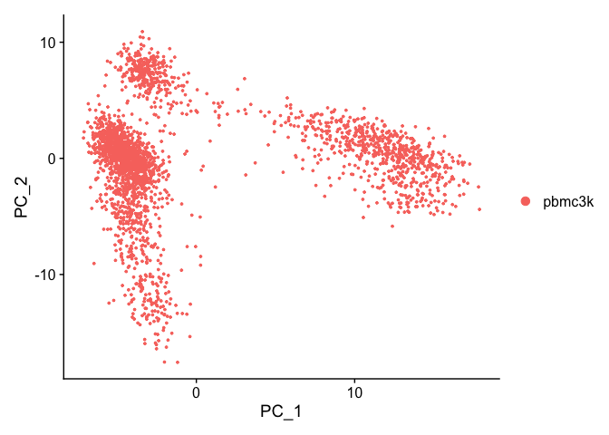

scRNA-seq Vignette with Seurat
================
Patrick Cherry
2023-04-29

- <a href="#setup-the-seurat-object"
  id="toc-setup-the-seurat-object">Setup the Seurat Object</a>
  - <a href="#get-scrna-data" id="toc-get-scrna-data">Get scRNA Data</a>
  - <a href="#load-data-into-seurat" id="toc-load-data-into-seurat">Load
    data into Seurat</a>
- <a href="#standard-pre-processing-workflow"
  id="toc-standard-pre-processing-workflow">Standard pre-processing
  workflow</a>
  - <a href="#qc-and-selecting-cells-for-further-analysis"
    id="toc-qc-and-selecting-cells-for-further-analysis">QC and selecting
    cells for further analysis</a>
    - <a href="#where-are-qc-metrics-stored-in-seurat"
      id="toc-where-are-qc-metrics-stored-in-seurat">Where are QC metrics
      stored in Seurat?</a>
  - <a href="#qc" id="toc-qc">QC</a>
- <a href="#normalizing-the-data"
  id="toc-normalizing-the-data">Normalizing the data</a>
- <a href="#feature-selection-identification-of-highly-variable-features"
  id="toc-feature-selection-identification-of-highly-variable-features">feature
  Selection (identification of highly variable features)</a>
- <a href="#scaling-the-data" id="toc-scaling-the-data">Scaling the
  data</a>
- <a href="#perform-linear-dimensional-reduction"
  id="toc-perform-linear-dimensional-reduction">Perform linear dimensional
  reduction</a>
- <a href="#determine-the-dimensionality-of-the-dataset"
  id="toc-determine-the-dimensionality-of-the-dataset">Determine the
  ‘dimensionality’ of the dataset</a>
- <a href="#cluster-the-cells" id="toc-cluster-the-cells">Cluster the
  cells</a>
- <a href="#run-non-linear-dimensional-reduction-umaptsne"
  id="toc-run-non-linear-dimensional-reduction-umaptsne">Run non-linear
  dimensional reduction (UMAP/tSNE)</a>
- <a href="#finding-differentially-expressed-features-cluster-biomarkers"
  id="toc-finding-differentially-expressed-features-cluster-biomarkers">Finding
  differentially expressed features (cluster biomarkers)</a>
- <a href="#assigning-cell-type-identity-to-clusters"
  id="toc-assigning-cell-type-identity-to-clusters">Assigning cell type
  identity to clusters</a>

[Install Seurat and
data](https://satijalab.org/seurat/articles/install.html) and [Seurat v5
vignettes](https://satijalab.org/seurat/articles/pbmc3k_tutorial.html)

# Setup the Seurat Object

For this tutorial, we will be analyzing the a dataset of Peripheral
Blood Mononuclear Cells (PBMC) freely available from 10X Genomics. There
are 2,700 single cells that were sequenced on the Illumina NextSeq 500.
The raw data can be found
[here](https://cf.10xgenomics.com/samples/cell/pbmc3k/pbmc3k_filtered_gene_bc_matrices.tar.gz).

We start by reading in the data. The `Read10X()` function reads in the
output of the
[cellranger](https://support.10xgenomics.com/single-cell-gene-expression/software/pipelines/latest/what-is-cell-ranger)
pipeline from 10X, returning a unique molecular identified (UMI) count
matrix. The values in this matrix represent the number of molecules for
each feature (i.e. gene; row) that are detected in each cell (column).

We next use the count matrix to create a `Seurat` object. The object
serves as a container that contains both data (like the count matrix)
and analysis (like PCA, or clustering results) for a single-cell
dataset. For a technical discussion of the `Seurat` object structure,
check out our [GitHub Wiki](https://github.com/satijalab/seurat/wiki).
For example, the count matrix is stored in `pbmc[["RNA"]]@counts`.

## Get scRNA Data

``` r
download.file("https://cf.10xgenomics.com/samples/cell/pbmc3k/pbmc3k_filtered_gene_bc_matrices.tar.gz",
              destfile = "pbmc3k_filtered_gene_bc_matrices.tar.gz")
```

## Load data into Seurat

``` r
# Load the PBMC dataset
pbmc.data <- Read10X(data.dir = "filtered_gene_bc_matrices/hg19/")

# Initialize the Seurat object with the raw (non-normalized data).
pbmc <- CreateSeuratObject(counts = pbmc.data, project = "pbmc3k", min.cells = 3, min.features = 200)
```

    ## Warning: Feature names cannot have underscores ('_'), replacing with dashes
    ## ('-')

``` r
pbmc
```

    ## An object of class Seurat 
    ## 13714 features across 2700 samples within 1 assay 
    ## Active assay: RNA (13714 features, 0 variable features)

\###What does data in a count matrix look like?

``` r
# Lets examine a few genes in the first thirty cells
pbmc.data[c("CD3D","TCL1A","MS4A1"), 1:30]
```

    ## 3 x 30 sparse Matrix of class "dgCMatrix"

    ##   [[ suppressing 30 column names 'AAACATACAACCAC-1', 'AAACATTGAGCTAC-1', 'AAACATTGATCAGC-1' ... ]]

    ##                                                                    
    ## CD3D  4 . 10 . . 1 2 3 1 . . 2 7 1 . . 1 3 . 2  3 . . . . . 3 4 1 5
    ## TCL1A . .  . . . . . . 1 . . . . . . . . . . .  . 1 . . . . . . . .
    ## MS4A1 . 6  . . . . . . 1 1 1 . . . . . . . . . 36 1 2 . . 2 . . . .

The `.` values in the matrix represent 0s (no molecules detected). Since
most values in an scRNA-seq matrix are 0, Seurat uses a sparse-matrix
representation whenever possible. This results in significant memory and
speed savings for Drop-seq/inDrop/10x data.

``` r
dense.size <- object.size(as.matrix(pbmc.data))
dense.size
```

    ## 709591472 bytes

``` r
sparse.size <- object.size(pbmc.data)
sparse.size
```

    ## 29905192 bytes

``` r
dense.size / sparse.size
```

    ## 23.7 bytes

<div class="aside">

23.7x difference. Sparse matrices for the win!

</div>

# Standard pre-processing workflow

The steps below encompass the standard pre-processing workflow for
scRNA-seq data in Seurat. These represent the selection and filtration
of cells based on QC metrics, data normalization and scaling, and the
detection of highly variable features.

## QC and selecting cells for further analysis

Seurat allows you to easily explore QC metrics and filter cells based on
any user-defined criteria. A few QC metrics [commonly
used](https://www.ncbi.nlm.nih.gov/pmc/articles/PMC4758103/) by the
community include

- The number of unique genes detected in each cell.
  - Low-quality cells or empty droplets will often have very few genes.
  - Cell doublets or multiplets may exhibit an aberrantly high gene
    count.
- Similarly, the total number of molecules detected within a cell
  (correlates strongly with unique genes).
- The percentage of reads that map to the mitochondrial genome.
  - Low-quality / dying cells often exhibit extensive mitochondrial
    contamination.
  - We calculate mitochondrial QC metrics with the
    `PercentageFeatureSet()` function, which calculates the percentage
    of counts originating from a set of features.
  - We use the set of all genes starting with `MT-` as a set of
    mitochondrial genes.

``` r
# The [[ operator can add columns to object metadata. This is a great place to stash QC stats
pbmc[["percent.mt"]] <- PercentageFeatureSet(pbmc, pattern = "^MT-")
```

### Where are QC metrics stored in Seurat?

- The number of unique genes and total molecules are automatically
  calculated during `CreateSeuratObject()`
  - You can find them stored in the object meta data

``` r
# Show QC metrics for the first 5 cells
head(pbmc@meta.data, 5)
```

<div class="kable-table">

|                  | orig.ident | nCount_RNA | nFeature_RNA | percent.mt |
|:-----------------|:-----------|-----------:|-------------:|-----------:|
| AAACATACAACCAC-1 | pbmc3k     |       2419 |          779 |  3.0177759 |
| AAACATTGAGCTAC-1 | pbmc3k     |       4903 |         1352 |  3.7935958 |
| AAACATTGATCAGC-1 | pbmc3k     |       3147 |         1129 |  0.8897363 |
| AAACCGTGCTTCCG-1 | pbmc3k     |       2639 |          960 |  1.7430845 |
| AAACCGTGTATGCG-1 | pbmc3k     |        980 |          521 |  1.2244898 |

</div>

## QC

In the example below, we visualize QC metrics, and use these to filter
cells.

- We filter cells that have unique feature counts over 2,500 or less
  than 200
- We filter cells that have \>5% mitochondrial counts

``` r
#Visualize QC metrics as a violin plot
VlnPlot(pbmc, features = c("nFeature_RNA", "nCount_RNA", "percent.mt"), ncol = 3)
```

<!-- -->

``` r
# FeatureScatter is typically used to visualize feature-feature relationships, but can be used for anything calculated by the object, i.e. columns in object metadata, PC scores etc.

pbmc <- subset(pbmc, subset = nFeature_RNA > 200 & nFeature_RNA < 2500 & percent.mt < 5)

plot1 <- FeatureScatter(pbmc, feature1 = "nCount_RNA", feature2 = "percent.mt") 
plot2 <- FeatureScatter(pbmc, feature1 = "nCount_RNA", feature2 = "nFeature_RNA") 
plot1 + plot2
```

<!-- -->

<div class="aside">

`FeatureScatter` returns a ggplot object (`feature1` by `feature2`
scatter plot) with the r-value correlation in the title.

I’m observing that percent mitochondrial RNA does not correlate strongly
with total RNA count. Feature count correlates very strongly with RNA
count, but appears to have diminishing returns at higher count values.

</div>

# Normalizing the data

After removing unwanted cells from the dataset, the next step is to
normalize the data. By default, we employ a global-scaling normalization
method “LogNormalize” that normalizes the feature expression
measurements for each cell by the total expression, multiplies this by a
scale factor (10,000 by default), and log-transforms the result.
Normalized values are stored in `pbmc[["RNA"]]@data`.

``` r
pbmc <- NormalizeData(pbmc, normalization.method = "LogNormalize", scale.factor = 1e4)
```

For clarity, in this previous line of code (and in future commands), we
provide the default values for certain parameters in the function call.
However, this isn’t required and the same behavior can be achieved with:

``` r
pbmc <- NormalizeData(pbmc)
```

# feature Selection (identification of highly variable features)

We next calculate a subset of features that exhibit high cell-to-cell
variation in the dataset (i.e, they are highly expressed in some cells,
and lowly expressed in others). We and
[others](https://www.nature.com/articles/nmeth.2645) have found that
focusing on these genes in downstream analysis helps to highlight
biological signal in single-cell datasets.

Our procedure in Seurat is described in detail
[here](https://doi.org/10.1016/j.cell.2019.05.031), and improves on
previous versions by directly modeling the mean-variance relationship
inherent in single-cell data, and is implemented in the
`FindVariableFeatures()` function. By default, we return 2,000 features
per dataset. These will be used in downstream analysis, like PCA.

``` r
pbmc <- FindVariableFeatures(pbmc, selection.method = 'vst', nfeatures = 2000)

# Identify the 10 most highly variable genes
top10 <- head(VariableFeatures(pbmc), 10)

# plot variable features with and without labels
plot1 <- VariableFeaturePlot(pbmc)
plot2 <- LabelPoints(plot = plot1, points = top10, repel = TRUE)
plot1 + plot2
```

<!-- -->

# Scaling the data

Next, we apply a linear transformation (‘scaling’) that is a standard
pre-processing step prior to dimensional reduction techniques like PCA.
The `ScaleData()` function:

- Shifts the expression of each gene, so that the mean expression across
  cells is 0
- Scales the expression of each gene, so that the variance across cells
  is 1
  - This step gives equal weight in downstream analyses, so that
    highly-expressed genes do not dominate
- The results of this are stored in `pbmc[["RNA"]]@scale.data`

``` r
all.genes <- rownames(pbmc)
pbmc <- ScaleData(pbmc, features = all.genes)
```

    ## Centering and scaling data matrix

\###This step takes too long! Can I make it faster? Scaling is an
essential step in the Seurat workflow, but only on genes that will be
used as input to PCA. Therefore, the default in `ScaleData()` is only to
perform scaling on the previously identified variable features (2,000 by
default). To do this, omit the `features` argument in the previous
function call, i.e.

``` r
pbmc <- ScaleData(pbmc)
```

Your PCA and clustering results will be unaffected. However, Seurat
heatmaps (produced as shown below with `DoHeatmap()`) require genes in
the heatmap to be scaled, to make sure highly-expressed genes don’t
dominate the heatmap. To make sure we don’t leave any genes out of the
heatmap later, we are scaling all genes in this tutorial.
</details>
  
<details>
<summary>
**How can I remove unwanted sources of variation, as in Seurat v2?**
</summary>

In `Seurat v2` we also use the `ScaleData()` function to remove unwanted
sources of variation from a single-cell dataset. For example, we could
‘regress out’ heterogeneity associated with (for example) cell cycle
stage, or mitochondrial contamination. These features are still
supported in `ScaleData()` in `Seurat v3`, i.e.:

``` r
pbmc <- ScaleData(pbmc, vars.to.regress = 'percent.mt')
```

However, particularly for advanced users who would like to use this
functionality, we strongly recommend the use of our new normalization
workflow, `SCTransform()`. The method is described in our
[paper](https://genomebiology.biomedcentral.com/articles/10.1186/s13059-019-1874-1),
with a separate vignette using Seurat v3
[here](sctransform_vignette.html). As with `ScaleData()`, the function
`SCTransform()` also includes a `vars.to.regress` parameter.
</details>

  

------------------------------------------------------------------------

# Perform linear dimensional reduction

Next we perform PCA on the scaled data. By default, only the previously
determined variable features are used as input, but can be defined using
`features` argument if you wish to choose a different subset.

``` r
pbmc <- RunPCA(pbmc, features = VariableFeatures(object = pbmc))
```

    ## PC_ 1 
    ## Positive:  CST3, TYROBP, LST1, AIF1, FTL, FTH1, LYZ, FCN1, S100A9, TYMP 
    ##     FCER1G, CFD, LGALS1, S100A8, CTSS, LGALS2, SERPINA1, IFITM3, SPI1, CFP 
    ##     PSAP, IFI30, SAT1, COTL1, S100A11, NPC2, GRN, LGALS3, GSTP1, PYCARD 
    ## Negative:  MALAT1, LTB, IL32, IL7R, CD2, B2M, ACAP1, CD27, STK17A, CTSW 
    ##     CD247, GIMAP5, AQP3, CCL5, SELL, TRAF3IP3, GZMA, MAL, CST7, ITM2A 
    ##     MYC, GIMAP7, HOPX, BEX2, LDLRAP1, GZMK, ETS1, ZAP70, TNFAIP8, RIC3 
    ## PC_ 2 
    ## Positive:  CD79A, MS4A1, TCL1A, HLA-DQA1, HLA-DQB1, HLA-DRA, LINC00926, CD79B, HLA-DRB1, CD74 
    ##     HLA-DMA, HLA-DPB1, HLA-DQA2, CD37, HLA-DRB5, HLA-DMB, HLA-DPA1, FCRLA, HVCN1, LTB 
    ##     BLNK, P2RX5, IGLL5, IRF8, SWAP70, ARHGAP24, FCGR2B, SMIM14, PPP1R14A, C16orf74 
    ## Negative:  NKG7, PRF1, CST7, GZMB, GZMA, FGFBP2, CTSW, GNLY, B2M, SPON2 
    ##     CCL4, GZMH, FCGR3A, CCL5, CD247, XCL2, CLIC3, AKR1C3, SRGN, HOPX 
    ##     TTC38, APMAP, CTSC, S100A4, IGFBP7, ANXA1, ID2, IL32, XCL1, RHOC 
    ## PC_ 3 
    ## Positive:  HLA-DQA1, CD79A, CD79B, HLA-DQB1, HLA-DPB1, HLA-DPA1, CD74, MS4A1, HLA-DRB1, HLA-DRA 
    ##     HLA-DRB5, HLA-DQA2, TCL1A, LINC00926, HLA-DMB, HLA-DMA, CD37, HVCN1, FCRLA, IRF8 
    ##     PLAC8, BLNK, MALAT1, SMIM14, PLD4, LAT2, IGLL5, P2RX5, SWAP70, FCGR2B 
    ## Negative:  PPBP, PF4, SDPR, SPARC, GNG11, NRGN, GP9, RGS18, TUBB1, CLU 
    ##     HIST1H2AC, AP001189.4, ITGA2B, CD9, TMEM40, PTCRA, CA2, ACRBP, MMD, TREML1 
    ##     NGFRAP1, F13A1, SEPT5, RUFY1, TSC22D1, MPP1, CMTM5, RP11-367G6.3, MYL9, GP1BA 
    ## PC_ 4 
    ## Positive:  HLA-DQA1, CD79B, CD79A, MS4A1, HLA-DQB1, CD74, HLA-DPB1, HIST1H2AC, PF4, TCL1A 
    ##     SDPR, HLA-DPA1, HLA-DRB1, HLA-DQA2, HLA-DRA, PPBP, LINC00926, GNG11, HLA-DRB5, SPARC 
    ##     GP9, AP001189.4, CA2, PTCRA, CD9, NRGN, RGS18, GZMB, CLU, TUBB1 
    ## Negative:  VIM, IL7R, S100A6, IL32, S100A8, S100A4, GIMAP7, S100A10, S100A9, MAL 
    ##     AQP3, CD2, CD14, FYB, LGALS2, GIMAP4, ANXA1, CD27, FCN1, RBP7 
    ##     LYZ, S100A11, GIMAP5, MS4A6A, S100A12, FOLR3, TRABD2A, AIF1, IL8, IFI6 
    ## PC_ 5 
    ## Positive:  GZMB, NKG7, S100A8, FGFBP2, GNLY, CCL4, CST7, PRF1, GZMA, SPON2 
    ##     GZMH, S100A9, LGALS2, CCL3, CTSW, XCL2, CD14, CLIC3, S100A12, CCL5 
    ##     RBP7, MS4A6A, GSTP1, FOLR3, IGFBP7, TYROBP, TTC38, AKR1C3, XCL1, HOPX 
    ## Negative:  LTB, IL7R, CKB, VIM, MS4A7, AQP3, CYTIP, RP11-290F20.3, SIGLEC10, HMOX1 
    ##     PTGES3, LILRB2, MAL, CD27, HN1, CD2, GDI2, ANXA5, CORO1B, TUBA1B 
    ##     FAM110A, ATP1A1, TRADD, PPA1, CCDC109B, ABRACL, CTD-2006K23.1, WARS, VMO1, FYB

Seurat provides several useful ways of visualizing both cells and
features that define the PCA, including `VizDimReduction()`,
`DimPlot()`, and `DimHeatmap()`

``` r
# Examine and visualize PCA results a few different ways
print(pbmc[['pca']], dims = 1:5, nfeatures = 5)
```

    ## PC_ 1 
    ## Positive:  CST3, TYROBP, LST1, AIF1, FTL 
    ## Negative:  MALAT1, LTB, IL32, IL7R, CD2 
    ## PC_ 2 
    ## Positive:  CD79A, MS4A1, TCL1A, HLA-DQA1, HLA-DQB1 
    ## Negative:  NKG7, PRF1, CST7, GZMB, GZMA 
    ## PC_ 3 
    ## Positive:  HLA-DQA1, CD79A, CD79B, HLA-DQB1, HLA-DPB1 
    ## Negative:  PPBP, PF4, SDPR, SPARC, GNG11 
    ## PC_ 4 
    ## Positive:  HLA-DQA1, CD79B, CD79A, MS4A1, HLA-DQB1 
    ## Negative:  VIM, IL7R, S100A6, IL32, S100A8 
    ## PC_ 5 
    ## Positive:  GZMB, NKG7, S100A8, FGFBP2, GNLY 
    ## Negative:  LTB, IL7R, CKB, VIM, MS4A7

``` r
VizDimLoadings(pbmc, dims = 1:2, reduction = 'pca')
```

<!-- -->

``` r
DimPlot(pbmc, reduction = 'pca')
```

<!-- -->

In particular `DimHeatmap()` allows for easy exploration of the primary
sources of heterogeneity in a dataset, and can be useful when trying to
decide which PCs to include for further downstream analyses. Both cells
and features are ordered according to their PCA scores. Setting `cells`
to a number plots the ‘extreme’ cells on both ends of the spectrum,
which dramatically speeds plotting for large datasets. Though clearly a
supervised analysis, we find this to be a valuable tool for exploring
correlated feature sets.

``` r
DimHeatmap(pbmc, dims = 1, cells = 500, balanced = TRUE)
```

<!-- -->

``` r
DimHeatmap(pbmc, dims = 1:15, cells = 500, balanced = TRUE)
```

<!-- -->

# Determine the ‘dimensionality’ of the dataset

To overcome the extensive technical noise in any single feature for
scRNA-seq data, Seurat clusters cells based on their PCA scores, with
each PC essentially representing a ‘metafeature’ that combines
information across a correlated feature set. The top principal
components therefore represent a robust compression of the dataset.
However, how many components should we choose to include? 10? 20? 100?

In [Macosko *et
al*](http://www.cell.com/abstract/S0092-8674(15)00549-8), we implemented
a resampling test inspired by the JackStraw procedure. We randomly
permute a subset of the data (1% by default) and rerun PCA, constructing
a ‘null distribution’ of feature scores, and repeat this procedure. We
identify ‘significant’ PCs as those who have a strong enrichment of low
p-value features.

``` r
# NOTE: This process can take a long time for big datasets, comment out for expediency. More approximate techniques such as those implemented in ElbowPlot() can be used to reduce computation time
pbmc <- JackStraw(pbmc, num.replicate = 100)
pbmc <- ScoreJackStraw(pbmc, dims = 1:20)
```

The `JackStrawPlot()` function provides a visualization tool for
comparing the distribution of p-values for each PC with a uniform
distribution (dashed line). ‘Significant’ PCs will show a strong
enrichment of features with low p-values (solid curve above the dashed
line). In this case it appears that there is a sharp drop-off in
significance after the first 10-12 PCs.

``` r
JackStrawPlot(pbmc, dims = 1:15)
```

    ## Warning: Removed 23496 rows containing missing values (`geom_point()`).

<!-- -->

An alternative heuristic method generates an ‘Elbow plot’: a ranking of
principle components based on the percentage of variance explained by
each one (`ElbowPlot()` function). In this example, we can observe an
‘elbow’ around PC9-10, suggesting that the majority of true signal is
captured in the first 10 PCs.

``` r
ElbowPlot(pbmc)
```

<!-- -->

Identifying the true dimensionality of a dataset – can be
challenging/uncertain for the user. We therefore suggest these three
approaches to consider. The first is more supervised, exploring PCs to
determine relevant sources of heterogeneity, and could be used in
conjunction with GSEA for example. The second implements a statistical
test based on a random null model, but is time-consuming for large
datasets, and may not return a clear PC cutoff. The third is a heuristic
that is commonly used, and can be calculated instantly. In this example,
all three approaches yielded similar results, but we might have been
justified in choosing anything between PC 7-12 as a cutoff.

We chose 10 here, but encourage users to consider the following:

- Dendritic cell and NK aficionados may recognize that genes strongly
  associated with PCs 12 and 13 define rare immune subsets (i.e. MZB1 is
  a marker for plasmacytoid DCs). However, these groups are so rare,
  they are difficult to distinguish from background noise for a dataset
  of this size without prior knowledge.
- We encourage users to repeat downstream analyses with a different
  number of PCs (10, 15, or even 50!). As you will observe, the results
  often do not differ dramatically.
- We advise users to err on the higher side when choosing this
  parameter. For example, performing downstream analyses with only 5 PCs
  does significantly and adversely affect results.

------------------------------------------------------------------------

# Cluster the cells

Seurat v3 applies a graph-based clustering approach, building upon
initial strategies in ([Macosko *et
al*](http://www.cell.com/abstract/S0092-8674(15)00549-8)). Importantly,
the *distance metric* which drives the clustering analysis (based on
previously identified PCs) remains the same. However, our approach to
partitioning the cellular distance matrix into clusters has dramatically
improved. Our approach was heavily inspired by recent manuscripts which
applied graph-based clustering approaches to scRNA-seq data [\[SNN-Cliq,
Xu and Su, Bioinformatics,
2015\]](http://bioinformatics.oxfordjournals.org/content/early/2015/02/10/bioinformatics.btv088.abstract)
and CyTOF data [\[PhenoGraph, Levine *et al*., Cell,
2015\]](http://www.ncbi.nlm.nih.gov/pubmed/26095251). Briefly, these
methods embed cells in a graph structure - for example a K-nearest
neighbor (KNN) graph, with edges drawn between cells with similar
feature expression patterns, and then attempt to partition this graph
into highly interconnected ‘quasi-cliques’ or ‘communities’.

As in PhenoGraph, we first construct a KNN graph based on the euclidean
distance in PCA space, and refine the edge weights between any two cells
based on the shared overlap in their local neighborhoods (Jaccard
similarity). This step is performed using the `FindNeighbors()`
function, and takes as input the previously defined dimensionality of
the dataset (first 10 PCs).

To cluster the cells, we next apply modularity optimization techniques
such as the Louvain algorithm (default) or SLM [\[SLM, Blondel *et al*.,
Journal of Statistical
Mechanics\]](http://dx.doi.org/10.1088/1742-5468/2008/10/P10008), to
iteratively group cells together, with the goal of optimizing the
standard modularity function. The `FindClusters()` function implements
this procedure, and contains a resolution parameter that sets the
‘granularity’ of the downstream clustering, with increased values
leading to a greater number of clusters. We find that setting this
parameter between 0.4-1.2 typically returns good results for single-cell
datasets of around 3K cells. Optimal resolution often increases for
larger datasets. The clusters can be found using the `Idents()`
function.

``` r
pbmc <- FindNeighbors(pbmc, dims = 1:10)
```

    ## Computing nearest neighbor graph

    ## Computing SNN

``` r
pbmc <- FindClusters(pbmc, resolution = 0.5)
```

    ## Modularity Optimizer version 1.3.0 by Ludo Waltman and Nees Jan van Eck
    ## 
    ## Number of nodes: 2638
    ## Number of edges: 95965
    ## 
    ## Running Louvain algorithm...
    ## Maximum modularity in 10 random starts: 0.8723
    ## Number of communities: 9
    ## Elapsed time: 0 seconds

``` r
# Look at cluster IDs of the first 5 cells
head(Idents(pbmc), 5)
```

    ## AAACATACAACCAC-1 AAACATTGAGCTAC-1 AAACATTGATCAGC-1 AAACCGTGCTTCCG-1 
    ##                2                3                2                1 
    ## AAACCGTGTATGCG-1 
    ##                6 
    ## Levels: 0 1 2 3 4 5 6 7 8

------------------------------------------------------------------------

# Run non-linear dimensional reduction (UMAP/tSNE)

Seurat offers several non-linear dimensional reduction techniques, such
as tSNE and UMAP, to visualize and explore these datasets. The goal of
these algorithms is to learn the underlying manifold of the data in
order to place similar cells together in low-dimensional space. Cells
within the graph-based clusters determined above should co-localize on
these dimension reduction plots. As input to the UMAP and tSNE, we
suggest using the same PCs as input to the clustering analysis.

``` r
# If you haven't installed UMAP, you can do so via reticulate::py_install(packages = "umap-learn")
pbmc <- RunUMAP(pbmc, dims = 1:10)
```

    ## Warning: The default method for RunUMAP has changed from calling Python UMAP via reticulate to the R-native UWOT using the cosine metric
    ## To use Python UMAP via reticulate, set umap.method to 'umap-learn' and metric to 'correlation'
    ## This message will be shown once per session

    ## 08:40:39 UMAP embedding parameters a = 0.9922 b = 1.112

    ## 08:40:39 Read 2638 rows and found 10 numeric columns

    ## 08:40:39 Using Annoy for neighbor search, n_neighbors = 30

    ## 08:40:39 Building Annoy index with metric = cosine, n_trees = 50

    ## 0%   10   20   30   40   50   60   70   80   90   100%

    ## [----|----|----|----|----|----|----|----|----|----|

    ## **************************************************|
    ## 08:40:39 Writing NN index file to temp file /var/folders/11/sfzn5hhx2995d534f55tvzd40000gn/T//Rtmp4C70vd/file8117980cbf3
    ## 08:40:39 Searching Annoy index using 1 thread, search_k = 3000
    ## 08:40:39 Annoy recall = 100%
    ## 08:40:40 Commencing smooth kNN distance calibration using 1 thread with target n_neighbors = 30
    ## 08:40:40 Initializing from normalized Laplacian + noise (using irlba)
    ## 08:40:40 Commencing optimization for 500 epochs, with 105124 positive edges
    ## 08:40:44 Optimization finished

``` r
# note that you can set `label = TRUE` or use the LabelClusters function to help label individual clusters
DimPlot(pbmc, reduction = 'umap')
```

<!-- -->

You can save the object at this point so that it can easily be loaded
back in without having to rerun the computationally intensive steps
performed above, or easily shared with collaborators.

``` r
saveRDS(pbmc, file = "../output/pbmc_tutorial.rds")
```

------------------------------------------------------------------------

# Finding differentially expressed features (cluster biomarkers)

Seurat can help you find markers that define clusters via differential
expression. By default, it identifies positive and negative markers of a
single cluster (specified in `ident.1`), compared to all other cells.
`FindAllMarkers()` automates this process for all clusters, but you can
also test groups of clusters vs. each other, or against all cells.

The `min.pct` argument requires a feature to be detected at a minimum
percentage in either of the two groups of cells, and the thresh.test
argument requires a feature to be differentially expressed (on average)
by some amount between the two groups. You can set both of these to 0,
but with a dramatic increase in time - since this will test a large
number of features that are unlikely to be highly discriminatory. As
another option to speed up these computations, `max.cells.per.ident` can
be set. This will downsample each identity class to have no more cells
than whatever this is set to. While there is generally going to be a
loss in power, the speed increases can be significant and the most
highly differentially expressed features will likely still rise to the
top.

``` r
# find all markers of cluster 2
cluster2.markers <- FindMarkers(pbmc, ident.1 = 2, min.pct = 0.25)
```

    ## For a more efficient implementation of the Wilcoxon Rank Sum Test,
    ## (default method for FindMarkers) please install the limma package
    ## --------------------------------------------
    ## install.packages('BiocManager')
    ## BiocManager::install('limma')
    ## --------------------------------------------
    ## After installation of limma, Seurat will automatically use the more 
    ## efficient implementation (no further action necessary).
    ## This message will be shown once per session

``` r
head(cluster2.markers, n = 5)
```

<div class="kable-table">

|      | p_val | avg_log2FC | pct.1 | pct.2 | p_val_adj |
|:-----|------:|-----------:|------:|------:|----------:|
| IL32 |     0 |  1.2154360 | 0.949 | 0.466 |         0 |
| LTB  |     0 |  1.2828597 | 0.981 | 0.644 |         0 |
| CD3D |     0 |  0.9359210 | 0.922 | 0.433 |         0 |
| IL7R |     0 |  1.1776027 | 0.748 | 0.327 |         0 |
| LDHB |     0 |  0.8837324 | 0.953 | 0.614 |         0 |

</div>

``` r
# find all markers distinguishing cluster 5 from clusters 0 and 3
cluster5.markers <- FindMarkers(pbmc, ident.1 = 5, ident.2 = c(0, 3), min.pct = 0.25)
head(cluster5.markers, n = 5)
```

<div class="kable-table">

|               | p_val | avg_log2FC | pct.1 | pct.2 | p_val_adj |
|:--------------|------:|-----------:|------:|------:|----------:|
| FCGR3A        |     0 |   4.267579 | 0.975 | 0.039 |         0 |
| IFITM3        |     0 |   3.877105 | 0.975 | 0.048 |         0 |
| CFD           |     0 |   3.411039 | 0.938 | 0.037 |         0 |
| CD68          |     0 |   3.014535 | 0.926 | 0.035 |         0 |
| RP11-290F20.3 |     0 |   2.722684 | 0.840 | 0.016 |         0 |

</div>

``` r
# find markers for every cluster compared to all remaining cells, report only the positive ones
pbmc.markers <- FindAllMarkers(pbmc, only.pos = TRUE, min.pct = 0.25, logfc.threshold = 0.25)
```

    ## Calculating cluster 0

    ## Calculating cluster 1

    ## Calculating cluster 2

    ## Calculating cluster 3

    ## Calculating cluster 4

    ## Calculating cluster 5

    ## Calculating cluster 6

    ## Calculating cluster 7

    ## Calculating cluster 8

``` r
pbmc.markers %>% group_by(cluster) %>% slice_max(n = 2, order_by = avg_log2FC)
```

<div class="kable-table">

| p_val | avg_log2FC | pct.1 | pct.2 | p_val_adj | cluster | gene     |
|------:|-----------:|------:|------:|----------:|:--------|:---------|
|     0 |   1.333503 | 0.435 | 0.108 |         0 | 0       | CCR7     |
|     0 |   1.069166 | 0.897 | 0.593 |         0 | 0       | LDHB     |
|     0 |   5.570063 | 0.996 | 0.215 |         0 | 1       | S100A9   |
|     0 |   5.477394 | 0.975 | 0.121 |         0 | 1       | S100A8   |
|     0 |   1.282860 | 0.981 | 0.644 |         0 | 2       | LTB      |
|     0 |   1.240361 | 0.424 | 0.111 |         0 | 2       | AQP3     |
|     0 |   4.310172 | 0.936 | 0.041 |         0 | 3       | CD79A    |
|     0 |   3.591579 | 0.622 | 0.022 |         0 | 3       | TCL1A    |
|     0 |   3.006740 | 0.595 | 0.056 |         0 | 4       | GZMK     |
|     0 |   2.966206 | 0.957 | 0.241 |         0 | 4       | CCL5     |
|     0 |   3.311697 | 0.975 | 0.134 |         0 | 5       | FCGR3A   |
|     0 |   3.085654 | 1.000 | 0.315 |         0 | 5       | LST1     |
|     0 |   4.917370 | 0.958 | 0.135 |         0 | 6       | GNLY     |
|     0 |   4.888172 | 0.986 | 0.071 |         0 | 6       | GZMB     |
|     0 |   3.871151 | 0.812 | 0.011 |         0 | 7       | FCER1A   |
|     0 |   2.874465 | 1.000 | 0.513 |         0 | 7       | HLA-DPB1 |
|     0 |   8.575862 | 1.000 | 0.024 |         0 | 8       | PPBP     |
|     0 |   7.243377 | 1.000 | 0.010 |         0 | 8       | PF4      |

</div>

Seurat has several tests for differential expression which can be set
with the test.use parameter (see our [DE vignette](de_vignette.html) for
details). For example, the ROC test returns the ‘classification power’
for any individual marker (ranging from 0 - random, to 1 - perfect).

``` r
cluster0.markers <- FindMarkers(pbmc, ident.1 = 0, logfc.threshold = 0.25, test.use = "roc", only.pos = TRUE)
```

We include several tools for visualizing marker expression. `VlnPlot()`
(shows expression probability distributions across clusters), and
`FeaturePlot()` (visualizes feature expression on a tSNE or PCA plot)
are our most commonly used visualizations. We also suggest exploring
`RidgePlot()`, `CellScatter()`, and `DotPlot()` as additional methods to
view your dataset.

``` r
VlnPlot(pbmc, features = c("MS4A1", "CD79A"))
```

<!-- -->

``` r
# you can plot raw counts as well
VlnPlot(pbmc, features = c("NKG7", "PF4"), slot = 'counts', log = TRUE)
```

<!-- -->

``` r
FeaturePlot(pbmc, features = c("MS4A1", "GNLY", "CD3E", "CD14", "FCER1A", "FCGR3A", "LYZ", "PPBP", "CD8A"))
```

<!-- -->

`DoHeatmap()` generates an expression heatmap for given cells and
features. In this case, we are plotting the top 20 markers (or all
markers if less than 20) for each cluster.

``` r
pbmc.markers %>% group_by(cluster) %>% top_n(n = 10, wt = avg_log2FC) -> top10
DoHeatmap(pbmc, features = top10$gene) + NoLegend()
```

<!-- -->

------------------------------------------------------------------------

# Assigning cell type identity to clusters

Fortunately in the case of this dataset, we can use canonical markers to
easily match the unbiased clustering to known cell types:

| Cluster ID | Markers       | Cell Type    |
|------------|---------------|--------------|
| 0          | IL7R, CCR7    | Naive CD4+ T |
| 1          | CD14, LYZ     | CD14+ Mono   |
| 2          | IL7R, S100A4  | Memory CD4+  |
| 3          | MS4A1         | B            |
| 4          | CD8A          | CD8+ T       |
| 5          | FCGR3A, MS4A7 | FCGR3A+ Mono |
| 6          | GNLY, NKG7    | NK           |
| 7          | FCER1A, CST3  | DC           |
| 8          | PPBP          | Platelet     |

``` r
new.cluster.ids <- c("Naive CD4 T", "CD14+ Mono", "Memory CD4 T", "B", "CD8 T", "FCGR3A+ Mono", "NK", "DC", "Platelet")
names(new.cluster.ids) <- levels(pbmc)
pbmc <- RenameIdents(pbmc, new.cluster.ids)
DimPlot(pbmc, reduction = 'umap', label = TRUE, pt.size = 0.5) + NoLegend()
```

<!-- -->

``` r
saveRDS(pbmc, file = "./output/pbmc3k_final.rds", compress = TRUE)
```

<!-- ```{r save2, include = FALSE} -->
<!-- saveRDS(pbmc, file = "./data/pbmc3k_final.rds", compress = TRUE) -->
<!-- ``` -->
<!-- ```{r save.times, include = FALSE} -->
<!-- write.csv(x = t(as.data.frame(all_times)), file = "./output/timings/pbmc3k_tutorial_times.csv") -->
<!-- ``` -->
